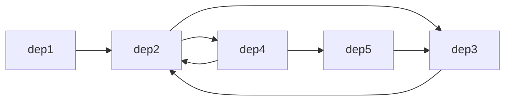
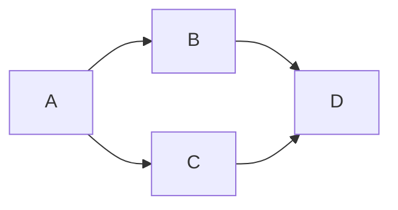
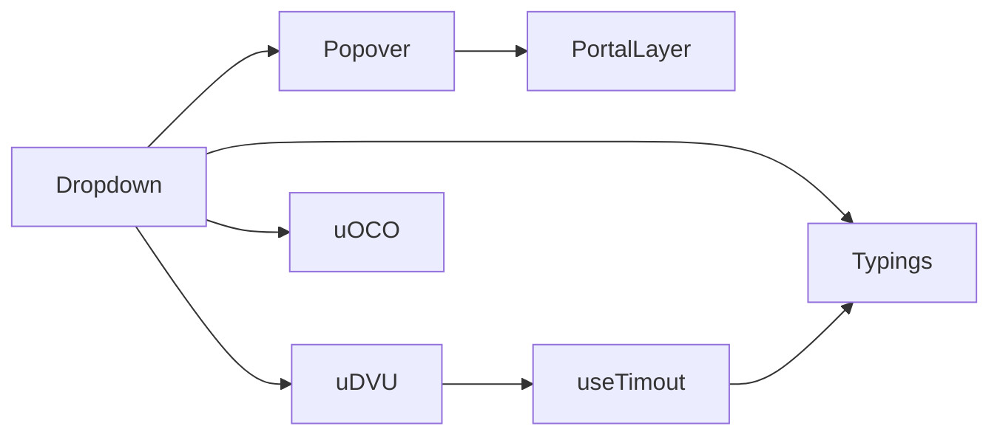
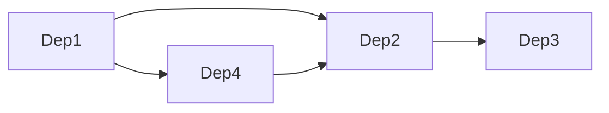
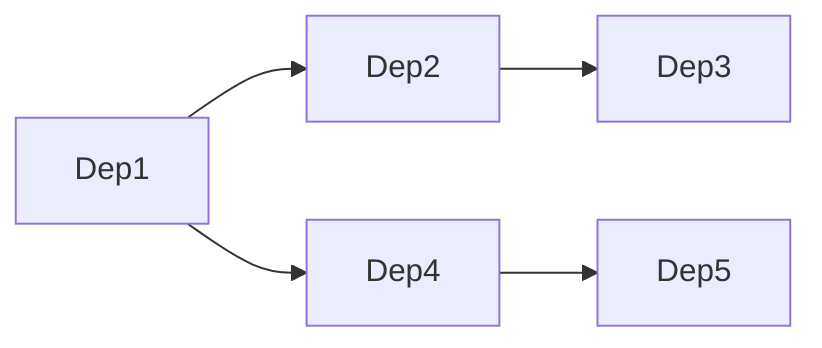
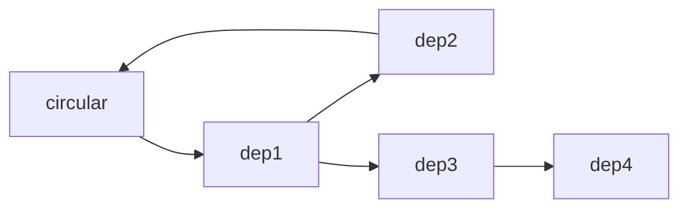
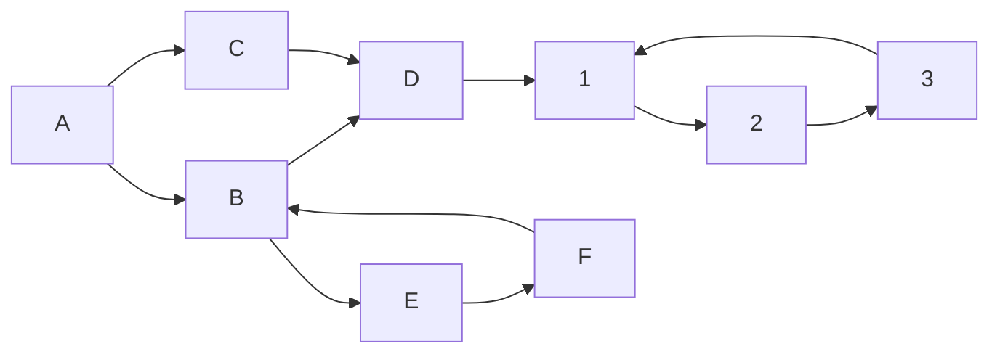
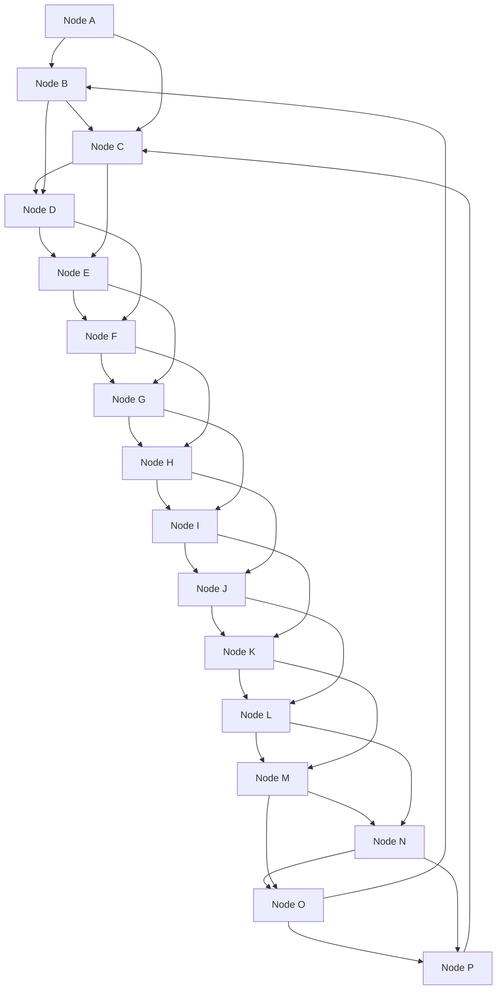

## circular_4

```mermaid
graph LR
    dep1-->dep2
    dep2-->dep3
    dep2-->dep4
    dep3-->dep2
    dep4-->dep2
    dep4-->dep5
    dep5-->dep3
```

## non_cyclic_graph

```mermaid
graph LR
    A-->B
    A-->C
    B-->D
    C-->D
```

## dag_5

```mermaid
graph LR
  D[Dropdown] --> T[Typings]
  D --> P[Popover] --> PL[PortalLayer]
  D --> UDV[uDVU]
  D --> UOCO[uOCO]
  UDV --> useTimout --> T
```

# Simple 6

```mermaid
flowchart LR
  Dep1 --> Dep2 & Dep4
  Dep2 --> Dep3
  Dep4 --> Dep2
```

# Simple 7

```mermaid
flowchart LR
  Dep1 --> Dep2 --> Dep3
  Dep1 --> Dep4 --> Dep5
```

# Circular 8

```mermaid
flowchart LR
  circular --> dep1
  dep1 --> dep2 & dep3
  dep2 --> circular
  dep3 --> dep4
```

# Circular 9

```mermaid
flowchart LR
  A --> B & C
    B --> D
    B --> E
    E --> F
    F --> B
    C --> D
    D --> 1
    1 --> 2
    2 --> 3
    3 --> 1
```

# Very complex circular 10

```mermaid
graph TD
    A[Node A] --> B[Node B]
    B --> C[Node C]
    C --> D[Node D]
    D --> E[Node E]
    E --> F[Node F]
    F --> G[Node G]
    G --> H[Node H]
    H --> I[Node I]
    I --> J[Node J]
    J --> K[Node K]
    K --> L[Node L]
    L --> M[Node M]
    M --> N[Node N]
    N --> O[Node O]
    O --> P[Node P]
    P --> C
    A --> C
    B --> D
    C --> E
    D --> F
    E --> G
    F --> H
    G --> I
    H --> J
    I --> K
    J --> L
    K --> M
    L --> N
    M --> O
    N --> P
    O --> B
```
