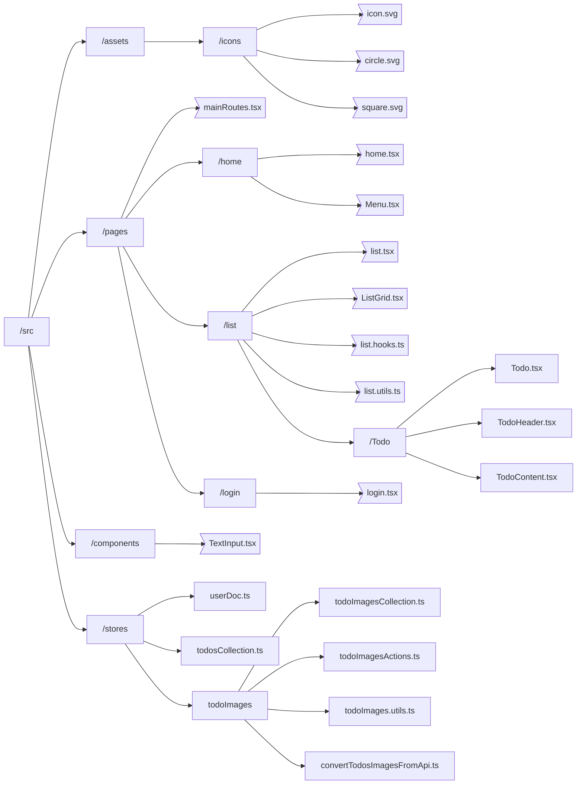
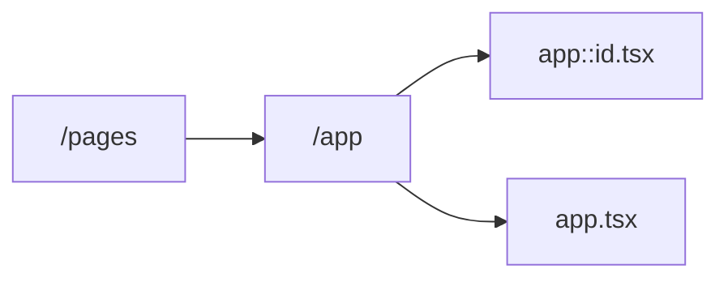

## Test structure

Considering a TODO app with the following routes:

- /: if logged then `app` else `login`
- app: logged area
  - /: pending todo itens
  - list: all todo itens
    - [id]: todo page
      - update: todo update page
- login: login page
  - /: login

## Param routes structure

App routes:
- /app
- /app/:id

Checks:

- /src/assets/icons only have svg icons

# Logic

- Only files/folder included in `folders` field will be checked
- Each file/folder will be checked againts all rules in its context. If some rule do not matches an error is throw
- Empty folders will be warned and ignored
